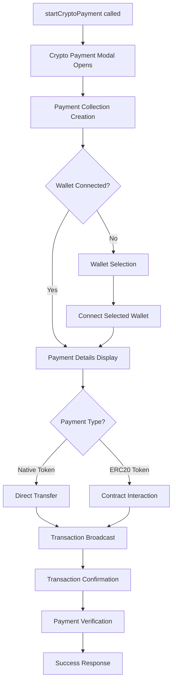
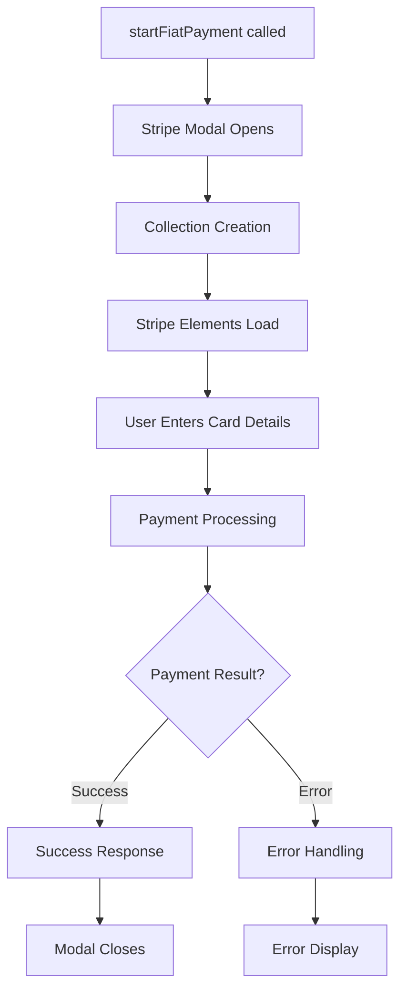

# @pakt/payment-module

This package provides React components for handling both fiat and cryptocurrency payments within Pakt applications. It integrates with Stripe for fiat payments and Wagmi v2 for crypto payments.

## Features

*   **Unified Payment System:** New ref-based API for seamless payment method selection
*   **Fiat Payments:** Uses Stripe Elements for secure credit card processing and onramp.
*   **Crypto Payments:** Integrates with Wagmi v2 for connecting wallets and initiating transactions.
*   **Flexible Configuration:** Support for enabling/disabling specific payment methods
*   **Complete Theme System:** Comprehensive theming with 60+ customizable design tokens
*   **Responsive Design:** Mobile-first approach with optimized layouts for all screen sizes
*   **TypeScript Support:** Full type safety with comprehensive TypeScript definitions

## Installation
```bash
yarn add @pakt/payment-module
# or
npm install @pakt/payment-module
# or
bun add @pakt/payment-module
```

## Setup

**Note:** Styles are automatically included when you import components from this module. No manual CSS import is required! ✨

```typescript
import React from 'react';
import { ConfigContextType, ITheme, wagmi } from '@pakt/payment-module';


const { createConfig, http, chains, connectors } = wagmi;
const { mainnet, sepolia } = chains; // Import desired chains
const { injected } = connectors; // Import desired connectors

// 1. Create your Wagmi config (v2)
const wagmiConfig = createConfig({
  chains: [mainnet, sepolia],
  connectors: [injected()],
  transports: {
    [mainnet.id]: http(),
    [sepolia.id]: http(),
  },
});

// 2. Define your Pakt Payment Module config
const paymentModuleConfig: ConfigContextType = {
  // Optional: Customize the theme (see Theme Customization section for details)
  theme: { 
    brandPrimary: '#007C5B',
    brandSecondary: '#ecfce5',
    headingText: '#1F2739',
    bodyText: '#6C757D',
    // ... see full theme options below
  },
  // crypto configuration is optional for crypto payments
  cryptoConfig: {
    wagmiConfig: wagmiConfig,
  },
  // stripe configuration is optional for fiat payments
  stripeConfig: {
    publicKey: 'YOUR_STRIPE_PUBLIC_KEY',
    clientSecret: 'YOUR_STRIPE_CLIENT_SECRET', 
    theme: 'light', // Optional: 'light' or 'dark'
  },
  // Required: Pakt configuration
  paktConfig: {
    baseUrl: 'YOUR_PAKT_API_BASE_URL',
    verbose: true, // Optional: Enable debug logging
  },
  // Optional: Provide custom error handling
  errorHandler: (errorMsg) => console.error("Payment Module Error:", errorMsg),
};

export default paymentModuleConfig;
```

**Configuration Options (`ConfigContextType`):**

*   `errorHandler?: (errorMessage: string) => void`: Optional callback function to handle errors originating from the module.
*   `theme?: ITheme`: Optional theme object to customize component appearance.
*   `cryptoConfig?: { wagmiConfig: Config }`: Optional. Required for crypto payments. Your Wagmi v2 configuration object.
*   `stripeConfig?: { publicKey: string; clientSecret: string; theme?: "light" | "dark"; }`: Optional. Required for fiat payments. Your Stripe configuration including public key, client secret, and optional theme setting.
*   `paktConfig: { baseUrl: string; verbose?: boolean }`: **Required.** Pakt API configuration including base URL and optional verbose logging.

## Usage

### Unified Payment System

The unified payment system provides a single component that can handle both crypto and fiat payments with an intuitive ref-based API.

```typescript
import React, { useRef } from 'react';
import PaktPaymentModule, { 
  PaymentSystemRef, 
  ConfigContextType, 
  onFinishResponseProps,
  PaymentData 
} from '@pakt/payment-module';

function MyPaymentComponent() {
  const paymentRef = useRef<PaymentSystemRef>(null);

  const handlePaymentSuccess = (response: onFinishResponseProps) => {
    console.log('Payment successful:', response);
    // Handle successful payment (e.g., show success message, redirect)
  };

  const handlePaymentError = (response: onFinishResponseProps) => {
    console.error('Payment failed:', response);
    // Handle payment error
  };

  const handleStartPayment = () => {
    // Start payment with automatic method selection
    paymentRef.current?.startPayment({
      amount: 10.5,
      coin: "USDC",
      description: "Service payment",
      isDirect: true,
      collectionType: "service",
      owner: "user-id",
      name: "Service Name"
    });
  };

  const handleStartCryptoPayment = () => {
    // Start crypto payment directly
    paymentRef.current?.startCryptoPayment({
      amount: 10.5,
      coin: "USDC", 
      description: "Crypto payment",
      isDirect: true,
      collectionType: "service",
      owner: "user-id",
      name: "Service Name"
    });
  };

  const handleStartFiatPayment = () => {
    // Start fiat payment directly
    paymentRef.current?.startFiatPayment({
      amount: 10.5,
      coin: "USD",
      description: "Card payment", 
      isDirect: false,
      collectionType: "service",
      owner: "user-id",
      name: "Service Name"
    });
  };

  return (
    <div>
      <button onClick={handleStartPayment}>
        Pay Now
      </button>
      <button onClick={handleStartCryptoPayment}>
        Pay with Crypto
      </button>
      <button onClick={handleStartFiatPayment}>
        Pay with Card
      </button>
      
      <PaktPaymentModule
        ref={paymentRef}
        config={paymentModuleConfig}
        onPaymentSuccess={handlePaymentSuccess}
        onPaymentError={handlePaymentError}
        enabledMethods={["crypto", "fiat"]} // Optional: specify which methods to enable
        isLoading={false}
      />
    </div>
  );
}
```

**PaktPaymentModule Props:**
* `config`: ConfigContextType - Your payment module configuration
* `onPaymentSuccess?`: (response: onFinishResponseProps) => void - Success callback
* `onPaymentError?`: (response: onFinishResponseProps) => void - Error callback  
* `enabledMethods?`: ("crypto" | "fiat")[] - Array of enabled payment methods (default: ["crypto", "fiat"])
* `isLoading?`: boolean - Loading state

**PaymentSystemRef Methods:**
* `startPayment(data: PaymentData)`: Start payment with automatic method selection
* `startCryptoPayment(data: PaymentData)`: Start crypto payment directly
* `startFiatPayment(data: PaymentData)`: Start fiat payment directly
* `close()`: Close any open payment modals

**PaymentData Interface:**
```typescript
interface PaymentData {
  amount: number;          // Payment amount
  coin: string;           // Currency/token symbol (e.g., "USDC", "USD")
  description: string;    // Payment description
  isDirect: boolean;      // Whether this is a direct payment
  collectionType: string; // Type of collection (e.g., "service", "tip")
  owner: string;          // Owner/recipient ID
  name: string;           // Collection/service name
}
```


## Configuration

The module requires a configuration object of type `ConfigContextType` that includes:

```typescript
interface ConfigContextType {
  // Optional configurations (enable features as needed)
  cryptoConfig?: {
    wagmiConfig: Config; // Your Wagmi v2 configuration
    wagmiProvider?: WagmiProviderProps;
    queryClient?: QueryClient;
  };
  stripeConfig?: {
    publicKey: string; // Your Stripe public key
    clientSecret: string; // Client secret for payment intent
    theme?: "light" | "dark";
  };
  // Required configuration
  paktConfig: {
    baseUrl: string; // Pakt API base URL
    verbose?: boolean; // Enable debug logging
  };
  errorHandler?: (errorMessage: string) => void; // Custom error handler
  theme?: ITheme; // Custom theme object
}
```

## Theme Customization

The payment module includes a comprehensive theming system that allows you to customize the appearance of all components. The theme uses semantic color names and supports both individual property customization and complete theme overrides.

### Theme Structure

The theme system is built around semantic design tokens organized into logical categories:

```typescript
interface ITheme {
  // Brand Colors - Your primary brand identity
  brandPrimary?: string;        // Main brand color (buttons, links, etc.)
  brandSecondary?: string;      // Secondary brand color (backgrounds, highlights)
  brandAccent?: string;         // Accent color (info states, highlights)
  
  // Text Colors - All text content
  headingText?: string;         // Main headings and titles
  bodyText?: string;            // Body text and descriptions
  linkText?: string;            // Clickable links and interactive text
  inverseText?: string;         // Text on dark backgrounds
  
  // Background Colors - Container and surface colors
  formBackground?: string;      // Form and input backgrounds
  modalOverlay?: string;        // Modal backdrop overlay
  pageBackground?: string;      // Main page background
  cardBackground?: string;      // Card and panel backgrounds
  
  // Border Colors - Separators and outlines
  borderColor?: string;         // Default borders and dividers
  dividerColor?: string;        // Section dividers and separators
  
  // Interactive Elements - Buttons and controls
  buttonPrimaryBackground?: string;      // Primary button background
  buttonPrimaryText?: string;            // Primary button text
  buttonPrimaryHover?: string;           // Primary button hover state
  buttonOutlineBackground?: string;      // Outline button background
  buttonOutlineText?: string;            // Outline button text
  buttonOutlineBorder?: string;          // Outline button border
  buttonOutlineHoverBackground?: string; // Outline button hover background
  buttonOutlineHoverText?: string;       // Outline button hover text
  
  // Form Input Colors - Input fields and controls
  inputBackground?: string;     // Input field backgrounds
  inputBorder?: string;         // Input field borders
  inputFocusBorder?: string;    // Input field focus state
  inputPlaceholder?: string;    // Placeholder text color
  inputText?: string;           // Input text color
  inputLabel?: string;          // Input label color
  
  // State Colors - Success, error, and warning states
  errorBackground?: string;     // Error message backgrounds
  errorText?: string;           // Error message text
  errorBorder?: string;         // Error state borders
  successBackground?: string;   // Success message backgrounds
  successText?: string;         // Success message text
  warningBackground?: string;   // Warning message backgrounds
  warningText?: string;         // Warning message text
  
  // Gradients - Advanced styling
  primaryGradient?: string;     // Primary gradient backgrounds
  secondaryGradient?: string;   // Secondary gradient backgrounds
  
  // Layout - Spacing and sizing
  modalBorderRadius?: string;   // Modal corner radius
}
```

### Basic Theme Customization

Here's how to customize your theme with common brand colors:

```typescript
const customTheme: ITheme = {
  // Brand identity
  brandPrimary: '#2563eb',      // Blue primary
  brandSecondary: '#dbeafe',    // Light blue secondary
  brandAccent: '#06b6d4',       // Cyan accent
  
  // Text customization
  headingText: '#1e293b',       // Dark gray headings
  bodyText: '#64748b',          // Medium gray body text
  linkText: '#2563eb',          // Blue links (matches brand)
  
  // Buttons
  buttonPrimaryBackground: 'linear-gradient(135deg, #2563eb 0%, #1d4ed8 100%)',
  buttonPrimaryText: '#ffffff',
  buttonPrimaryHover: '#1d4ed8',
  
  // State colors
  errorText: '#dc2626',
  successText: '#16a34a',
  warningText: '#d97706',
};

const config: ConfigContextType = {
  theme: customTheme,
  // ... other config
};
```

### Advanced Theme Examples

#### Dark Theme
```typescript
const darkTheme: ITheme = {
  brandPrimary: '#60a5fa',
  brandSecondary: '#1e293b',
  brandAccent: '#06b6d4',
  
  headingText: '#f1f5f9',
  bodyText: '#cbd5e1',
  linkText: '#60a5fa',
  inverseText: '#0f172a',
  
  formBackground: '#1e293b',
  modalOverlay: 'rgba(0, 0, 0, 0.75)',
  pageBackground: '#0f172a',
  cardBackground: '#1e293b',
  
  borderColor: '#334155',
  dividerColor: '#334155',
  
  inputBackground: '#334155',
  inputBorder: '#475569',
  inputFocusBorder: '#60a5fa',
  inputPlaceholder: '#94a3b8',
  inputText: '#f1f5f9',
  
  modalBorderRadius: '12px',
};
```

#### Minimal Theme
```typescript
const minimalTheme: ITheme = {
  brandPrimary: '#000000',
  brandSecondary: '#f5f5f5',
  
  headingText: '#000000',
  bodyText: '#666666',
  linkText: '#000000',
  
  borderColor: '#e5e5e5',
  
  buttonPrimaryBackground: '#000000',
  buttonPrimaryText: '#ffffff',
  buttonPrimaryHover: '#333333',
  
  buttonOutlineBackground: 'transparent',
  buttonOutlineText: '#000000',
  buttonOutlineBorder: '#000000',
  buttonOutlineHoverBackground: '#000000',
  buttonOutlineHoverText: '#ffffff',
  
  modalBorderRadius: '0px',
};
```

#### Corporate Theme
```typescript
const corporateTheme: ITheme = {
  brandPrimary: '#1f2937',
  brandSecondary: '#f3f4f6',
  brandAccent: '#3b82f6',
  
  headingText: '#111827',
  bodyText: '#6b7280',
  linkText: '#3b82f6',
  
  formBackground: '#ffffff',
  cardBackground: '#f9fafb',
  
  borderColor: '#d1d5db',
  
  buttonPrimaryBackground: 'linear-gradient(180deg, #1f2937 0%, #111827 100%)',
  buttonPrimaryText: '#ffffff',
  buttonPrimaryHover: '#111827',
  
  successText: '#059669',
  errorText: '#dc2626',
  warningText: '#d97706',
  
  modalBorderRadius: '8px',
};
```

### Theme Integration

The theme system automatically applies your custom values throughout all components:

1. **CSS Custom Properties**: Theme values are converted to CSS custom properties for maximum flexibility
2. **Tailwind Integration**: All theme tokens are available as Tailwind utility classes
3. **Component Consistency**: Every component uses the same theme tokens for consistent styling
4. **Runtime Updates**: Theme changes are applied immediately without requiring restarts


## Payment Flow

The payment module supports multiple payment flows depending on your integration needs:

### 1. Unified Payment Flow

The unified flow provides automatic payment method selection with a single integration point:

```mermaid
graph TD
    A[User clicks "Pay"] --> B[Payment Module Opens]
    B --> C{Payment Methods Available?}
    C -->|Both| D[Method Selection Screen]
    C -->|Crypto Only| E[Crypto Payment Flow]
    C -->|Fiat Only| F[Fiat Payment Flow]
    D -->|User selects Crypto| E
    D -->|User selects Fiat| F
    E --> G[Wallet Connection]
    G --> H[Transaction Confirmation]
    H --> I[Payment Success]
    F --> J[Stripe Payment Form]
    J --> K[Card Processing]
    K --> I
    I --> L[Success Callback]
```

```typescript
// Unified flow implementation
const paymentRef = useRef<PaymentSystemRef>(null);

const startPayment = () => {
  paymentRef.current?.startPayment({
    amount: 100,
    coin: "USDC",
    description: "Service payment",
    isDirect: true,
    collectionType: "service",
    owner: "user-id",
    name: "Service Name"
  });
};
```

### 2. Direct Crypto Payment Flow

For crypto-specific integrations, bypass method selection:



### 3. Direct Fiat Payment Flow

For fiat-only integrations using Stripe:



### 4. Hook-Based Payment Flow

For advanced integrations with custom UI:

```typescript
const {
  payment,
  loading,
  error,
  initiateCryptoPayment,
  validateCryptoPayment,
} = usePaymentModule();

const customPaymentFlow = async () => {
  // Step 1: Initiate payment
  const initResponse = await initiateCryptoPayment({
    collectionType: "service",
    amount: 100,
    coin: "USDC",
    description: "Custom payment",
    isDirect: true,
    owner: "user-id",
  });
  
  if (initResponse.status === 'success') {
    // Step 2: Handle the payment with your custom UI
    // Payment data is available in `payment` state
    
    // Step 3: Validate payment after user completes transaction
    const validationResponse = await validateCryptoPayment(
      payment.collectionId,
      5, // retries
      3000 // retry delay in ms
    );
    
    if (validationResponse.status === 'success') {
      // Payment confirmed
    }
  }
};
```

### Payment States

The payment module manages several states throughout the payment process:

```typescript
type PaymentState = 
  | 'idle'              // No payment in progress
  | 'initiating'        // Creating payment collection
  | 'method-selection'  // User selecting payment method
  | 'connecting'        // Connecting to wallet (crypto)
  | 'confirming'        // User confirming transaction
  | 'processing'        // Payment being processed
  | 'verifying'         // Verifying payment completion
  | 'success'           // Payment completed successfully
  | 'error';            // Payment failed

// State is managed automatically and available through callbacks
const handlePaymentSuccess = (response: onFinishResponseProps) => {
  // response.status === 'success'
  // response.txId contains transaction ID
  // response.message contains success message
};

const handlePaymentError = (response: onFinishResponseProps) => {
  // response.status === 'error'
  // response.message contains error details
};
```

### Error Handling

The payment module provides comprehensive error handling:

```typescript
const config: ConfigContextType = {
  // Global error handler for all payment module errors
  errorHandler: (errorMessage: string) => {
    console.error("Payment Module Error:", errorMessage);
    
    // Custom error handling logic
    if (errorMessage.includes('insufficient funds')) {
      showNotification('Please ensure you have sufficient balance');
    } else if (errorMessage.includes('network')) {
      showNotification('Network error, please try again');
    } else {
      showNotification('Payment failed, please contact support');
    }
  },
  
  // ... other config
};
```

Common error scenarios:
- **Wallet Connection Errors**: User rejects connection, wallet not installed
- **Network Errors**: RPC failures, network congestion
- **Transaction Errors**: Insufficient funds, gas estimation failures
- **Validation Errors**: Payment not found, verification timeouts
- **Configuration Errors**: Missing API keys, invalid settings

## Hooks

The package also provides a custom hook for advanced payment operations:

```typescript
import { usePaymentModule, UsePaymentModuleReturn, PaymentResponse } from '@pakt/payment-module';

function MyComponent() {
  const {
    payment,
    loading,
    error,
    initiateCryptoPayment,
    validateCryptoPayment,
    clearError,
    clearPayment
  } = usePaymentModule();

  const handleCryptoPayment = async () => {
    const response = await initiateCryptoPayment({
      // payment data
    });
    
    if (response.status === 'success') {
      // Payment initiated successfully
      const validationResponse = await validateCryptoPayment(collectionId);
      // Handle validation result
    }
  };

  const handleClearError = () => {
    clearError();
  };

  const handleClearPayment = () => {
    clearPayment();
  };

  return (
    <div>
      {loading && <p>Loading...</p>}
      {error && (
        <div>
          <p>Error: {error}</p>
          <button onClick={handleClearError}>Clear Error</button>
        </div>
      )}
      <button onClick={handleCryptoPayment}>
        Start Crypto Payment
      </button>
      <button onClick={handleClearPayment}>
        Clear Payment Data
      </button>
    </div>
  );
}
```

**usePaymentModule Return Type:**
```typescript
interface UsePaymentModuleReturn {
  // State
  payment: Payment | null;
  loading: boolean;
  error: string | null;
  
  // Payment Methods
  initiateCryptoPayment: (payload: any) => Promise<PaymentResponse<any>>;
  validateCryptoPayment: (collectionId: string, retries?: number, retryDelay?: number) => Promise<PaymentResponse<any>>;
  
  // Utility Methods
  clearError: () => void;
  clearPayment: () => void;
}
```

## Types Reference

The package exports comprehensive TypeScript types for better development experience:

### Core Types

```typescript
// Configuration interface
interface ConfigContextType {
  cryptoConfig?: {
    wagmiConfig: Config;
    wagmiProvider?: WagmiProviderProps;
    queryClient?: QueryClient;
  };
  stripeConfig?: {
    publicKey: string;
    clientSecret: string;
    theme?: "light" | "dark";
  };
  paktConfig: {
    baseUrl: string;
    verbose?: boolean;
  };
  errorHandler?: (errorMessage: string) => void;
  theme?: ITheme;
}

// Payment data structure
interface PaymentData {
  amount: number;          // Payment amount
  coin: string;           // Currency/token symbol
  description: string;    // Payment description
  isDirect: boolean;      // Whether this is a direct payment
  collectionType: string; // Type of collection
  owner: string;          // Owner/recipient ID
  name: string;           // Collection/service name
}

// Response interface for payment callbacks
interface onFinishResponseProps {
  status: "success" | "error";
  message: string;
  txId: string;
  collectionId?: string;
}

// Theme customization interface
interface ITheme {
  // Brand Colors
  brandPrimary?: string;
  brandSecondary?: string;
  brandAccent?: string;
  
  // Text Colors
  headingText?: string;
  bodyText?: string;
  linkText?: string;
  inverseText?: string;
  
  // Background Colors
  formBackground?: string;
  modalOverlay?: string;
  pageBackground?: string;
  cardBackground?: string;
  
  // Border Colors
  borderColor?: string;
  dividerColor?: string;
  
  // Interactive Elements
  buttonPrimaryBackground?: string;
  buttonPrimaryText?: string;
  buttonPrimaryHover?: string;
  buttonOutlineBackground?: string;
  buttonOutlineText?: string;
  buttonOutlineBorder?: string;
  buttonOutlineHoverBackground?: string;
  buttonOutlineHoverText?: string;
  
  // Form Input Colors
  inputBackground?: string;
  inputBorder?: string;
  inputFocusBorder?: string;
  inputPlaceholder?: string;
  inputText?: string;
  inputLabel?: string;
  
  // State Colors
  errorBackground?: string;
  errorText?: string;
  errorBorder?: string;
  successBackground?: string;
  successText?: string;
  warningBackground?: string;
  warningText?: string;
  
  // Gradients
  primaryGradient?: string;
  secondaryGradient?: string;
  
  // Layout
  modalBorderRadius?: string;
  

}
```

### Component Props Types

```typescript
// Main payment module props
interface PaymentSystemProps {
  onPaymentSuccess?: (response: onFinishResponseProps) => void;
  onPaymentError?: (response: onFinishResponseProps) => void;
  enabledMethods?: ("crypto" | "fiat")[];
  isLoading?: boolean;
}

// Payment system ref methods
type PaymentSystemRef = {
  startPayment: (data: PaymentData) => void;
  startCryptoPayment: (data: PaymentData) => void;
  startFiatPayment: (data: PaymentData) => void;
  close: () => void;
};


```

### Hook Types

```typescript
// usePaymentModule hook return type
interface UsePaymentModuleReturn {
  payment: Payment | null;
  loading: boolean;
  error: string | null;
  initiateCryptoPayment: (payload: any) => Promise<PaymentResponse<any>>;
  validateCryptoPayment: (collectionId: string, retries?: number, retryDelay?: number) => Promise<PaymentResponse<any>>;
  clearError: () => void;
  clearPayment: () => void;
}

// Payment response type
interface PaymentResponse<T = any> {
  status: 'success' | 'error';
  message: string;
  data: T;
  statusCode: number;
}
```

### Utility Types

```typescript
// Generic any type
type IAny = any;

// Ethereum address type
type I0xAddressType = `0x${string}`;
```

## Quick Start Example

Here's a complete example showing how to use the package with proper TypeScript types:

```typescript
import React, { useRef, useState } from 'react';
import { createConfig, http } from 'wagmi';
import { avalancheFuji } from 'wagmi/chains';
import { injected } from 'wagmi/connectors';

import PaktPaymentModule, {
  PaymentSystemRef,
  ConfigContextType,
  PaymentData,
  onFinishResponseProps,
  usePaymentModule,
  UsePaymentModuleReturn,
  PaymentResponse
} from '@pakt/payment-module';

// Wagmi configuration
const wagmiConfig = createConfig({
  chains: [avalancheFuji],
  connectors: [injected()],
  transports: {
    [avalancheFuji.id]: http(),
  },
});

// Payment module configuration
const config: ConfigContextType = {
  cryptoConfig: {
    wagmiConfig,
  },
  stripeConfig: {
    publicKey: 'pk_test_...',
    clientSecret: 'pi_...',
    theme: 'dark',
  },
  paktConfig: {
    baseUrl: 'https://api.pakt.com/v1',
    verbose: true,
  },
};

function App() {
  const paymentRef = useRef<PaymentSystemRef>(null);
  const [isLoading, setIsLoading] = useState(false);

  const handlePaymentSuccess = (response: onFinishResponseProps) => {
    console.log('Payment successful:', response);
    setIsLoading(false);
  };

  const handlePaymentError = (response: onFinishResponseProps) => {
    console.error('Payment failed:', response);
    setIsLoading(false);
  };

  const startPayment = () => {
    setIsLoading(true);
    const paymentData: PaymentData = {
      amount: 100,
      coin: 'USDC',
      description: 'Service payment',
      isDirect: true,
      collectionType: 'service',
      owner: 'user-123',
      name: 'Premium Service'
    };
    paymentRef.current?.startPayment(paymentData);
  };

  return (
    <div>
      <button onClick={startPayment} disabled={isLoading}>
        {isLoading ? 'Processing...' : 'Pay $100'}
      </button>
      
      <PaktPaymentModule
        ref={paymentRef}
        config={config}
        onPaymentSuccess={handlePaymentSuccess}
        onPaymentError={handlePaymentError}
        enabledMethods={['crypto', 'fiat']}
        isLoading={isLoading}
      />
    </div>
  );
}

export default App;
```

## Changelog

### v0.3.0
- 🎨 **New**: Comprehensive theme system with 60+ customizable design tokens
- 🎨 **New**: Semantic color naming for improved maintainability
- 🎨 **New**: Built-in theme examples (Dark, Minimal, Corporate)
- 🎨 **New**: CSS custom properties integration with Tailwind
- 🔄 **New**: Multiple payment flow patterns with detailed documentation
- 📱 **Enhanced**: Mobile-first responsive design
- 🔧 **Improved**: Component consistency across all payment interfaces
- ⚡ **Enhanced**: Button positioning and layout improvements
- 🎯 **Added**: Comprehensive error handling patterns
- 📚 **Major**: Complete documentation overhaul with visual flow diagrams


## Contributing

Please refer to the `CODE_OF_CONDUCT.md` and `LICENSE` files.

## License

MIT
